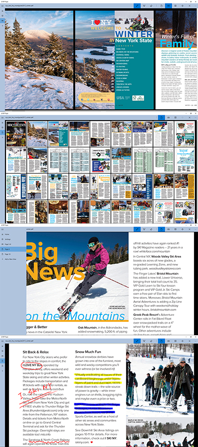

# Libra: Q PDF Pages
## A PDF reader for Windows 10
*Last Updated on December 2015.*

This app is available in [Windows store](https://www.microsoft.com/en-us/store/apps/q-pdf-pages/9nblggh68vck).
The source code is available at [GitHub](https://github.com/qiuosier/Libra).

Q PDF Pages is a lightweight PDF reader designed for windows tablets. It is not intended to be a powerful PDF application. Instead, it is an app for reading PDFs and taking some simple notes.

Some key features include:

* View pages vertically or horizontally
* Keep multiple view settings
* Easily switch between views
* Take notes with stylus
* Export notes and pages to images

The motivation for making this app, is that I can hardly find an app that satisfy my needs. I don't have Surface, but I have an old ThinkPad Tablet 2. I want a responsive reader on my old tablet. A bunch of apps can do that. I also want to take notes with the stylus. There are a few apps for taking notes, but few of them can distinguish between touch inputs and stylus inputs, which important for me. The stylus is much more precise and pressure sensitive. Since Windows has built in palm rejection, I can rest my hand on the tablet while writing with the stylus. There is one leading app which can do this, however, its performance is very poor on my old tablet and it crashes a lot. I am not sure if it works better on high-end tablets like Surface Pro. Anyway, the app does not work for me. Eventually, I make my own app for me. It reads PDFs, and it keeps my notes. I want to keep it simple.

The PDF pages are rendered using the APIs provided by Microsoft (Windows.Data.Pdf namespace). I do noticed some rendering issues:

* Some images, especially some background images will be rendered at a low quality.
* Embedded annotations (e.g. sticky notes inserted by Adobe Acrobat) cannot be displayed.

Unfortunately, the open source PDF APIs currently do not support the universal windows app development. And, I have no intention to purchase commercial PDF APIs. Therefore, these issues will remain for a while.

Since Microsoft does not provide APIs for saving PDFs, my app cannot save the notes into the PDF files. However, the notes are kept in the app, so I can see the notes when I reopen the same file. In the future, I would like to develop a "notes manager" in the app for exporting/importing the notes, so that the notes can be displayed on another computer.

