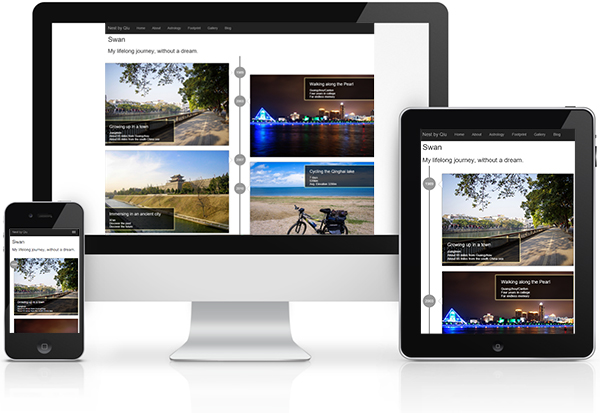

# Qiu's Bird Nest

After finishing my PhD dissertation in 2015, I think it's a good time to make a nest for my little birds... The bird nest is my personal website showing my words and my pictures. The first version of my bird nest was built with ASP.NET MVC (the Model-View-Controller pattern). In 2017, as I have been working on the Python-Django framework for a while and Google App Engine seems to be more reliable, I decided to "renovate" my bird nest with Python-Django, and the Material Design.

I intended to make my bird nest look great in any screen with responsive design.

# My Little Birds

## Swift
It was February 13th 2006, one day before the Valentine's Day, I used "Swift" to name my blog on MSN live space. Now live space no longer live, and Swift moved to Wordpress. I haven't really write anything since I started my PhD. Working towards a PhD does not keep me busy. But, there are just so many distractions...

## Skylark
Skylark started its journey in 2010, as Wordpress does not provide a gallery. I used Aperture to sync the pictures with Flickr. As Apple no longer update Aperture, I moved my pictures to Lightroom. Since then, I was too lazy to reconnect Flickr...

## Sparrow
Sparrow was used to host my works, with a history that can be traced back to 2009. Linkedin was not that popular at that time, so I also ask Sparrow to pick up my resume. When looking at the history of Sparrow, I see the ideas are changing so rapidly...

## Swan
Swan is young, she enjoy the leisure time with me...

# Qiu Qin
My name pronounces like "Chiu Chin". I always feel my names are elegant as you can rotate the "u" to get an "n". In Chinese, my first name comes from the first song of the Classic of Poetry, the oldest existing collection of Chinese poetry. And my last name can be found in the second piece of it. Thanks to my parents.

I was born on a mountainside and grew up near the south China sea. Learn more about my footprints with [Swan](/Swan "Swan").

See my [CV](/rhythm/CV "Qiu's Resume").
