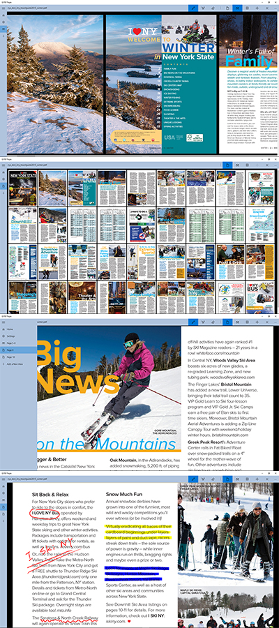

# Libra: Q PDF Pages
## A PDF reader for Windows 10
*Last Updated on May 2018.*

This app is available in [Windows store](https://www.microsoft.com/en-us/store/apps/q-pdf-pages/9nblggh68vck).
The source code is available at [GitHub](https://github.com/qiuosier/Libra).

Q PDF Pages is a PDF viewer designed for windows tablets with stylus (e.g. the surface pen). It is not intended to be a powerful PDF application. Instead, it is an app for reading PDF files and taking some simple notes with the stylus.

The key features include:

* View pages vertically or horizontally
* Keep multiple views and easily switch between views
* Take notes with stylus

### Motivation
I like the idea of having a pen for a tablet when Microsoft introduce the first generation of Surface Pro. Here, a pen means a real digital pen like surface pen or Apple pencil, not a capacitive stylus similating the touch input. The digital pen is much more precise and pressure sensitive. However, back in 2013, in the Windows App store, I can hardly find PDF viewer satisfies my simple needs: taking notes with the pen while moving the content with my fingers. A app should distinguish between touch inputs and pen inputs. There is one leading app which can do this, however, when I tried it in 2014, its performance was very poor on my old tablet and it crashes a lot. I am not sure if it works better on high-end tablets. Anyway, the app does not work for me (and now it becomes expensive to use). Eventually, I make my own app in 2015. It reads PDFs, and it keeps my notes. I want to keep it simple.

### Known Issues
The PDF pages are rendered using the APIs provided by Microsoft (Windows.Data.Pdf namespace). I do noticed some rendering issues:

* Some images, especially some background images will be rendered at a low quality.
* Embedded annotations (e.g. sticky notes inserted by Adobe Acrobat) cannot be displayed.

Unfortunately, I have no intention to purchase commercial PDF APIs. Therefore, these issues will remain for a while.

### The App

