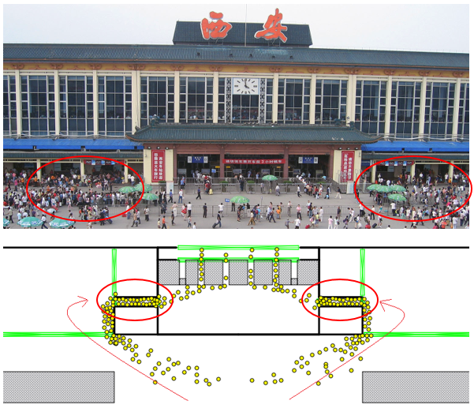
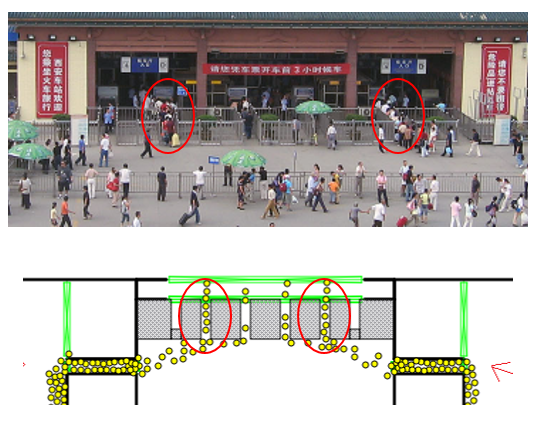

# Chaos, Modeling and Simulation of Pedestrians

### Abstract
Simulating crowd dynamics is of significance in evaluating emergency, designing architecture and pedestrian facilities. We proposed an approach with hierarchical environmental and agent structures for crowd dynamics simulation. Integrating perception, cognitive control, path planning, reactive movement appearance and characteristics components in an agent, we reproduced several self-emerge phenomena of pedestrian flows in public environment.

### Results
The key result in this project is that I reproduced the scenario of people entering a train station. Most people in China travel with trains. The train station is usually pretty crowded and people have to go through the security before entering the station. Here I am simulating the security check point. They have this special settings to slow down people as they go through the security. We can see the congestions at the both sides. That's where they check tickets. So you have to have a ticket in order to get in. 

After the ticket check, everyone has to go through a security check. Here there are four security gates. Since the two gate at the two sides are closer to the ticket check point, people tend to go there even if they have to wait a little bit. My simulation reproduced this phenomenon.

### Publication
Qiu Qin; Junhu Wei, "An agent-based approach for crowd dynamics simulation", Proceedings of 2010 IEEE International Conference on Intelligent Computing and Intelligent Systems, Oct. 2010, Xiamen, China.
