# Biking Across the Himalayas

_July 2011_

## An unforgettable bike trip from Lhasa to Kathmandu
After working as a volunteer in Tibet for a year, it was time to say goodbye. After a little bit of a chat with Peng, we decided to bike across the Himalayas from Lhasa. The trip turned out to be the most valuable memory I have...

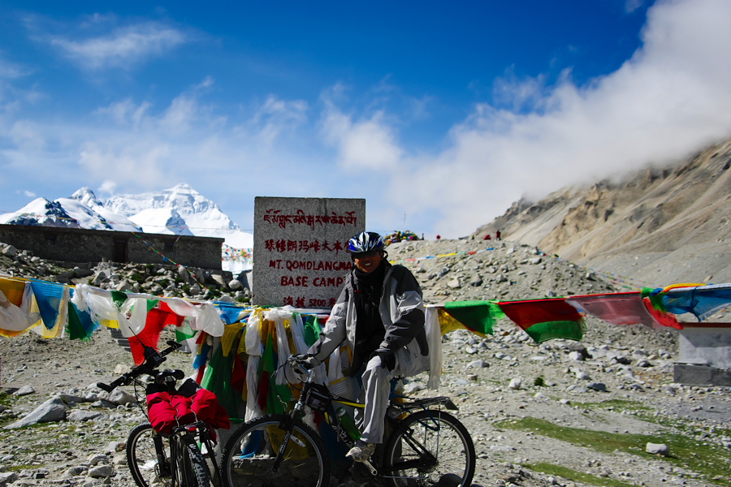

Peng was an old friend. We worked and play together when we were both studying in Xi'an. This time, he came to visit me from Shanghai, with his bike. After cycling around Lhasa, the capital of Tibet, for two or three weeks, we started our cross-mountain journey. We did not climb the Mt. Everest, but we spent a night at the base camp in a tent. I still remember that, when I woke up the next morning (on July 18th, 2011), the temperature was about 3 degree Celsius (about 37.5 Fahrenheit).

The total distance is about 994 kilometers, or 618 miles. We were cycling on an average elevation of 3938 meters (12,920 feet) for two weeks. We crossed the highest point in our trip on July 14th, and rested for a day on July 15th. We used Google Maps and Google Earth to plan the trip and get the data (See our [Lhasa-Kathmandu Trip Plan - Chinese](../../../static/images/swan/LK/KATHMANDU_S.pdf)).

I don't really know how to write the Tibetan names in English, so I will leave them in Chinese.

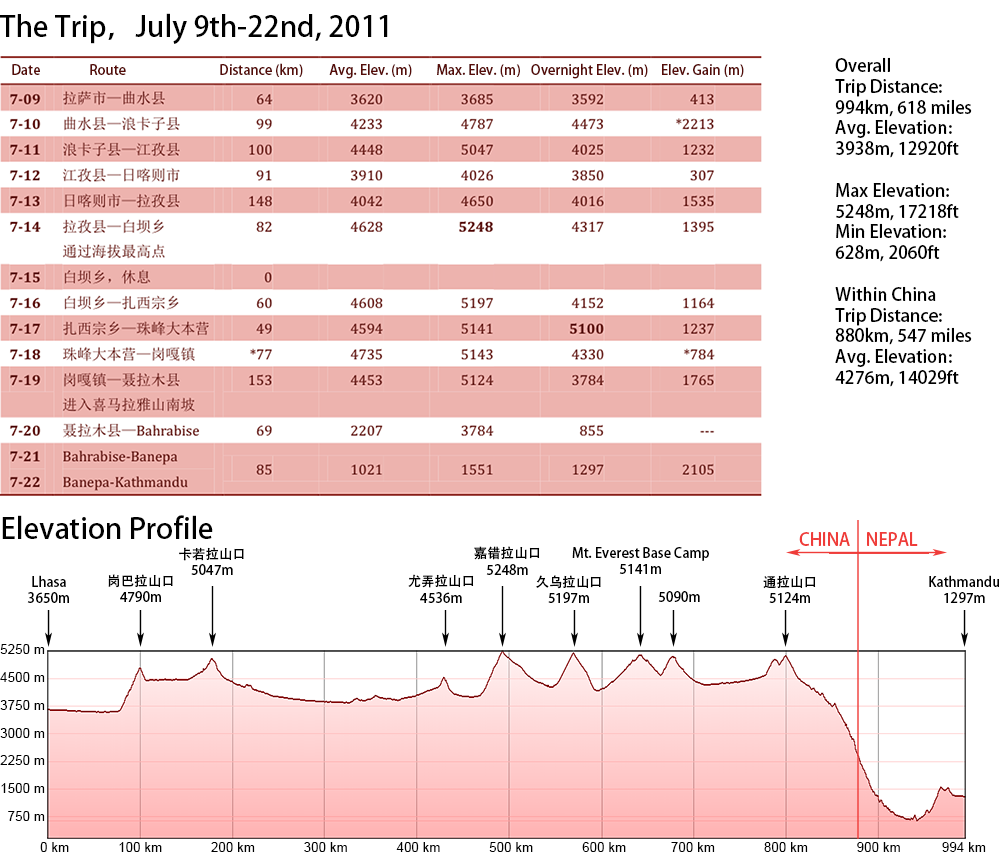

Unlike the eastern part of China, towns and villages are sparsely located in Tibet. Also, native Tibetan people in most small villages speak only the Tibetic language, which I hardly understand. Finding somewhere to sleep overnight is not something easy. Although it was summer, the temperature usually drop below 10 degrees celsius (50 Fahrenheit) during the night due to the high elevation. Anyway, we decided to plan carefully and not to carry a tent (which is somewhat heavy for people riding a bike) with us.

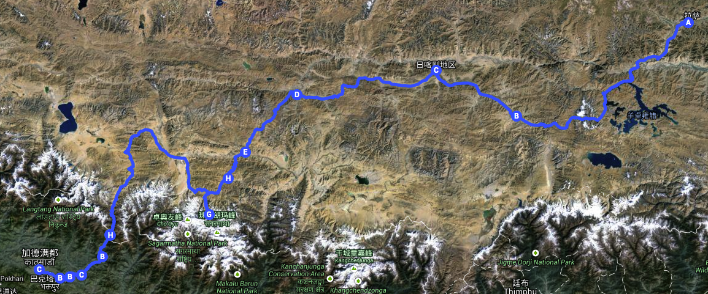
A super annoying thing is, for China, there is an offset (encrypted, see [Wikipedia](https://en.wikipedia.org/wiki/Restrictions_on_geographic_data_in_China)) between the map data (which provides the routes) and the satellite data (which provides the elevation) due to the government regulation. So I have to align the elevation data with the routes by myself. The elevation gain seems far from accurate for two days (7/10 and 7/19). Also, the data for 7/18 are just very rough estimation since the route does not exist on the map (actually there is hardly a road, or path to follow). 

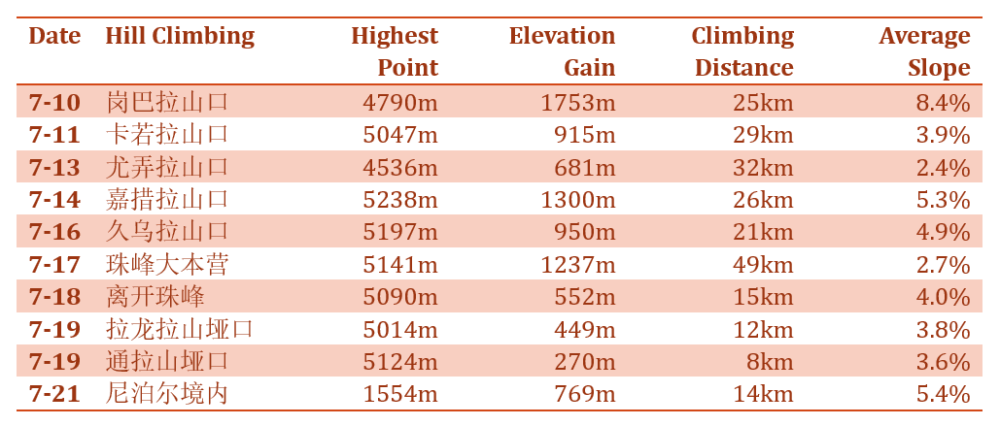
Crossing the Himalayas is like going up and down hills one after another. We crossed 10 passes climbing during the trip. The first one was actually the toughest one. We went from the 3000 meters range to the 4000 meters range after the first climb. The last climb in Nepal is much easier as the elevation is much lower. The highest point we reached was not around the Mt. Everest base camp, but on the way before that. At the base camp, we had the overnight stay with highest elevation (5100m, 16732ft).

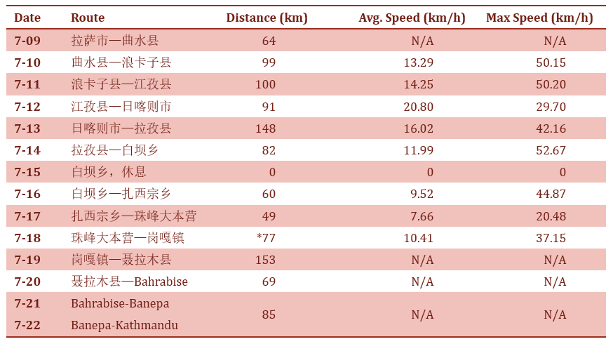
When cycling on a flat road, we had an average speed around 20 km/h (12.5 mph). When climbing long distance uphill, usually we did about 5 km/h (6 mph). We were cycling for fun and we stopped frequently to take pictures. Going downhill at 50km/h (31 mph) was a bit crazy... Unfortunately we were not able to track all the data along the trip as water went into my bike computer and Peng lost his phone (with all his data) in Kathmandu.

## Day 1, Breeze Along the River

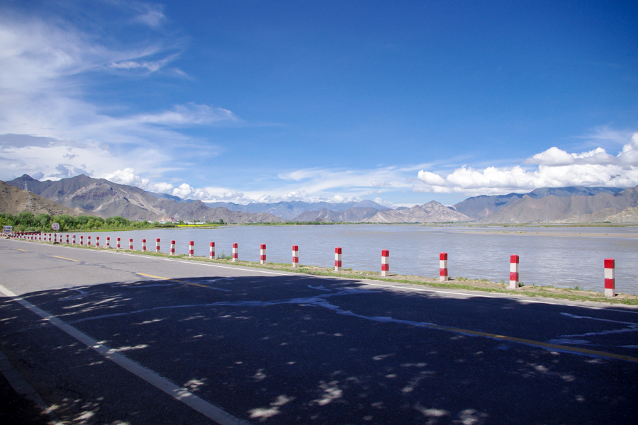
We started the trip from Lhasa after lunch. Although it is the capital of Tibet, Lhasa is small city surrounded by mountains. I lived on the northeast side of the city. We went through the city quickly as we were heading southwest. The first day was going along the Lhasa river for about 3 hours, pretty flat and easy (elevation around 3650m), as we planned to leave the hill climbing for the next morning.

We stayed at the town of [Quxu](https://en.wikipedia.org/wiki/Q%C3%BCx%C3%BC) for the night. This is a relative big town with a few streets since it is near Lhasa. Finding a place to eat and a place to sleep was easy here. We also bought some food for the lunch the next day. During the whole trip in China, we had to prepare lunch for the next day and eat on the way, as there is no where to buy food on the way.

There is only a single time zone in China. Lhasa is geographically about 2 hours away from Beijing. The sunset is usually after 9:30PM during the summer. We watched the sunset in our hotel room and went to sleep, looking forward to the trip in the next two weeks.

## Day 2, Yamdrok Lake
The second day was tough, but with spectacular view.

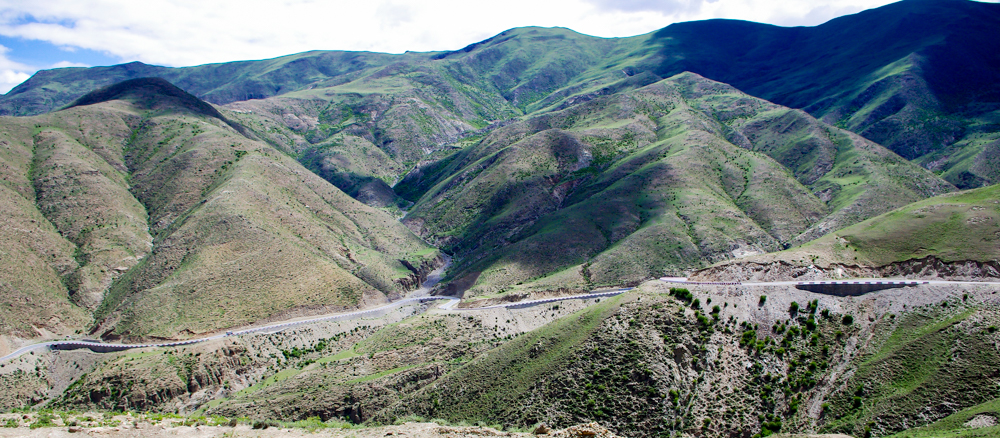
Soon after we got out of the town, we started climbing up the hill. There is shorter way to go with less climbing, which most traffic goes as it is more effecient. We picked the hard way because I would like Peng to see the Yamdrok lake (Yamzhog Yumco), one of the three holy lakes in Tibet. Right before we started this trip, Peng and I cycled to another holy lake, Namtso, where we experienced snow in July.

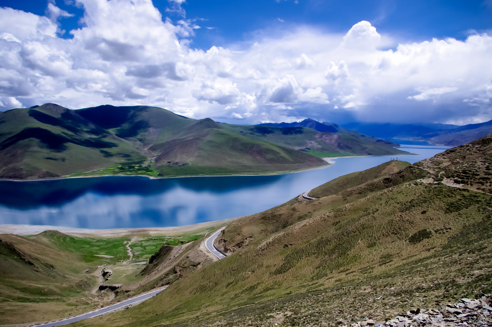
 While Namtso is a salt water lake, Yamdrok is a fresh water lake. I had been to this lake several times during the year. The first time was with my other friends, who were also volunteers at Lhasa. At that time we were on a weekend trip and we totally under-estimated the difficuty to go up the hill with a bike. This time I am more prepared. We climbed 25 km uphill to the Gampa La Pass in about 5 hours...then we see the lake...

 We spent about 30 minutes looking at the lake from the top of the hill. Then we slide down to the lake side, with a top speed of 50+ km/h (30+ MPH). The road stretches along the lake for another 3 hours. We stayed at Nagarzê for the night.

## Day 3, Karo La Glacier

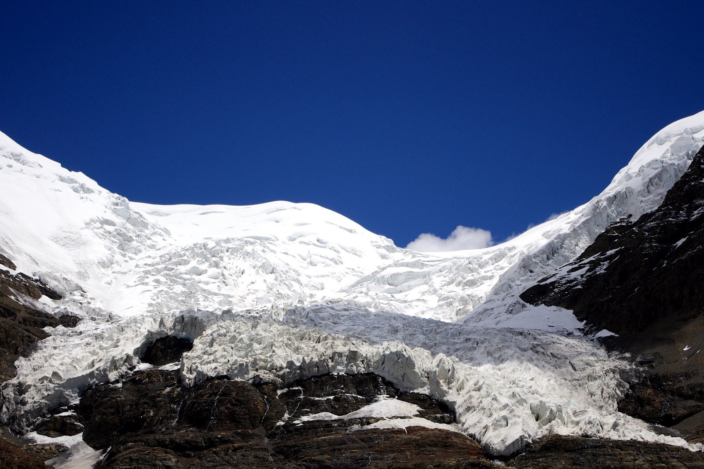
We went above the elevation of 5000m (16404ft) for the first time this day. However,it was not as difficult as the previous day. We had much less elevation gain and a much smaller average slope. Around the Karo La Pass (elevation 5047m), The glacier is only a few hundred meters away from the road.

We stayed at the historical town of [Gyantse](https://en.wikipedia.org/wiki/Gyantse) for the night.

## Day 4, Flowers Along the Road
This is another day with flat elevation profile, which gave us a break after climbing up for two days. Unfortunately, I got a flat tire and I have to spend some time on replacing the tube in the afternoon. In the late after noon, we reached Shigatse, the second largest city in Tibet. We still had some time to go around the city before sunset.

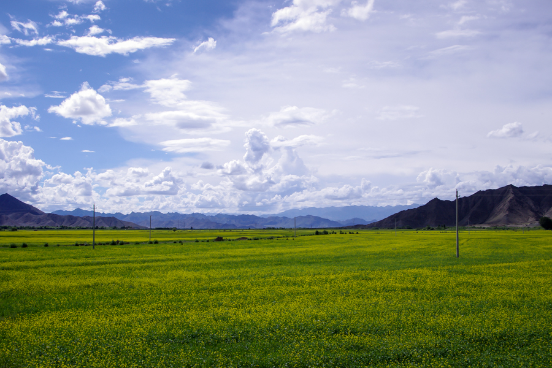

## Day 5, Endless and Darkness
We spent some time around the city in the morning, and we continue our trip around noon. This day we had to either go 60km or 150km, as those are the only two towns in which we can find somewhere to sleep. By the way, we consider sleeping in a tent along this trip as unsafe, since we can hardly find anyone along the way. The cell phone signal is bad along the way. Once there is any unexpected emergency, it would be hard to get help as we only have bicycles.

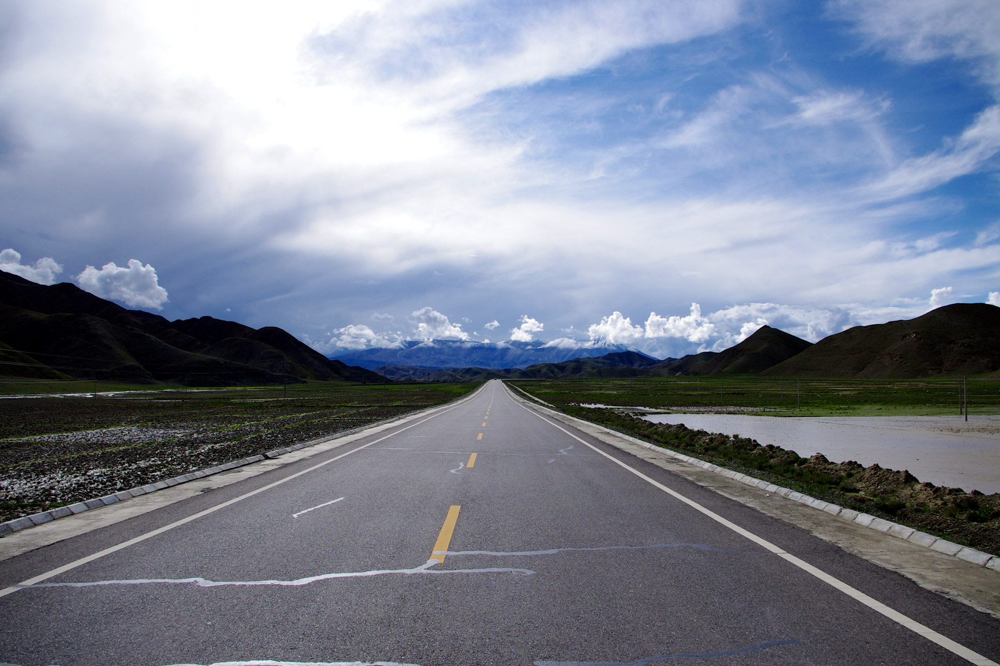

We got to the 60km town in about 3 hours...I would rather call it a village. We decided to continue but that was a terrible idea. We ended up climbing up a pass in the darkness (thanks to a Tibetan guy who drove a tractor...he let us hold the tractor and "pulled" us up the hill for quite a distance. We went down the hill slowly under the moonlight...and in the silence. Finally we finished our 150km after mid-night.

## Day 6
Another tough day...reached the highest point (5248m, 17218ft) on our route.

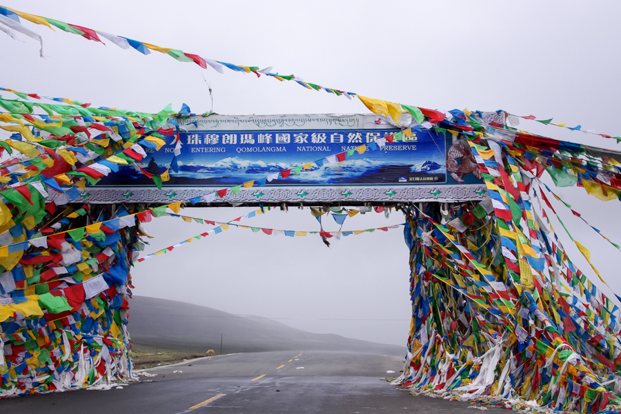

We feel a little bit foggy as we approaching the highest point. And it begins to rain after we went through it. I also reached the highest speed during the descent.

## Day 7
At Tingri, We decided to take a rest before heading to the Mt. Everest base camp. You can find good place to sleep here, because many tourists stays here when the visit the base camp. This is also a relatively good place to buy food and get supplies.

## Day 8
We left the main road and head to the base camp in the morning. It is an 100km dusty rough road. 

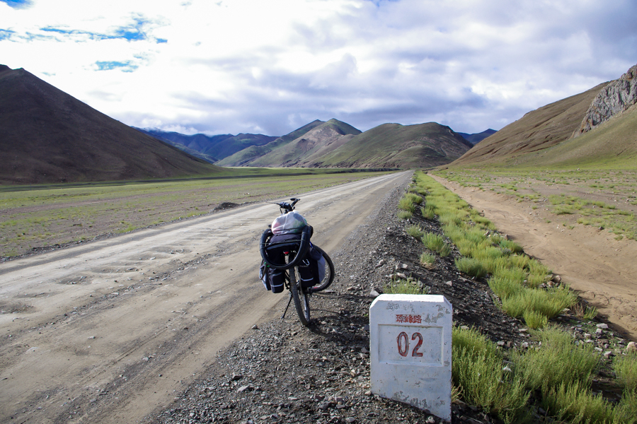

We only planned to go 60km this day. I believe it is not fun to go this way at night. And it is cold at night.

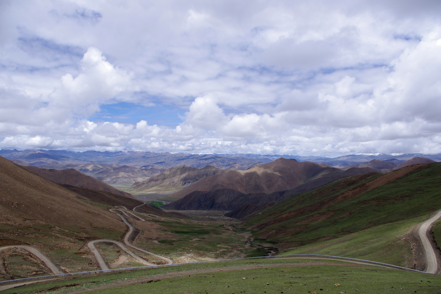

We also need to climb up a pass before really climbing up to the base camp. A lot of people said, the pass is the best place to view the 4 8000m+ summits in a row. Unfortunately, it seems the clouds are covering the summits.

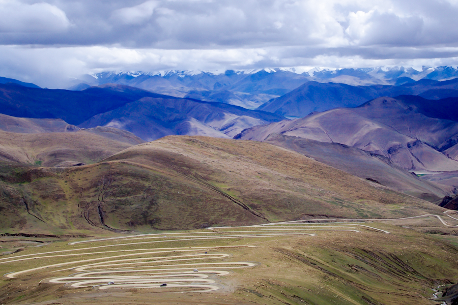

## Day 9
Reached the base camp in the afternoon, and spent a long time watching the sunset.

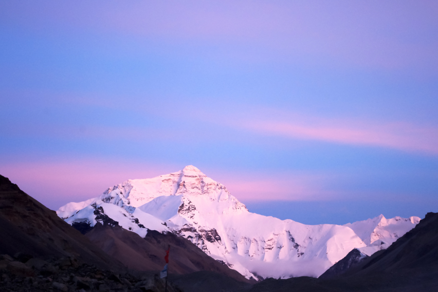

## Day 10
We went up a little bit to take a closer look after sunrise... 

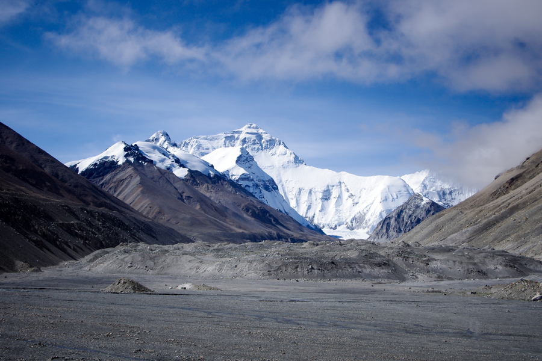

Leaving the base camp and back to the main road...We did not go back with the way came in. Instead, we tried a way that are now no longer in the map (It was used before the current way to Mt. Everest was built, but no longer maintained). We enjoyed the view along the way, though sometimes it was not easy to find the way. We can hardly see anyone on the way.

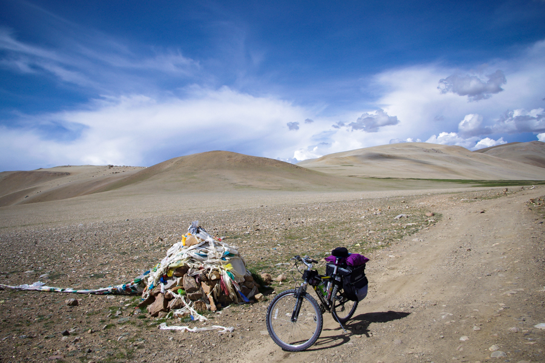

## Day 11
Again we tried to go 150km in a day, and again we did not get to our destination until late night. After we got to the top of the last pass, there is a 100km+ downhill...The elevation goes down from 5100m to 650m.We stayed at Nyalam, about half way down, for the night.
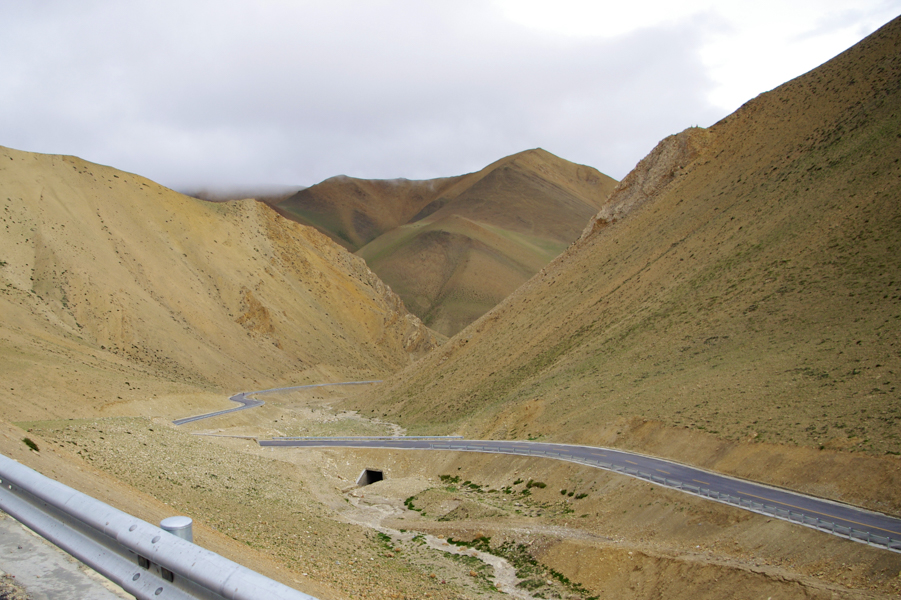

## Day 12
We ran into the fog, the moisture and the rain soon after we departed in the morning.

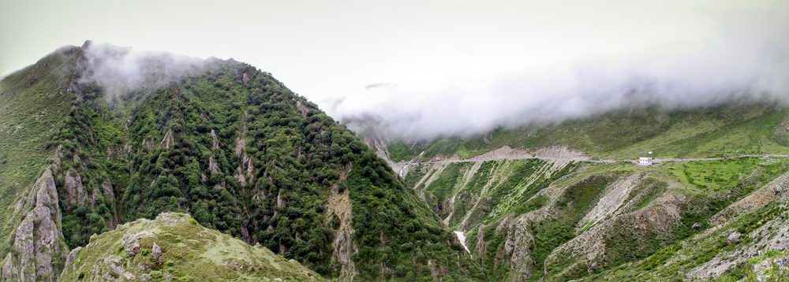

## Day 13
To be continued...

<!-- [Lhasa-Kathmandu Trip Plan (Chinese)](../../../static/images/swan/LK/Swan_LK_Day1.jpg) -->