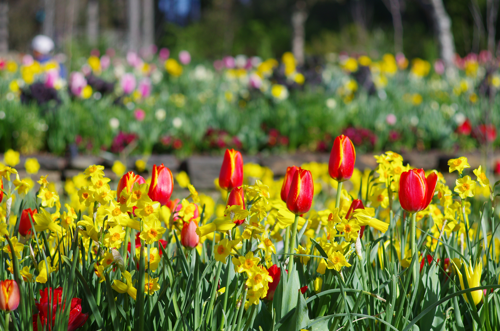
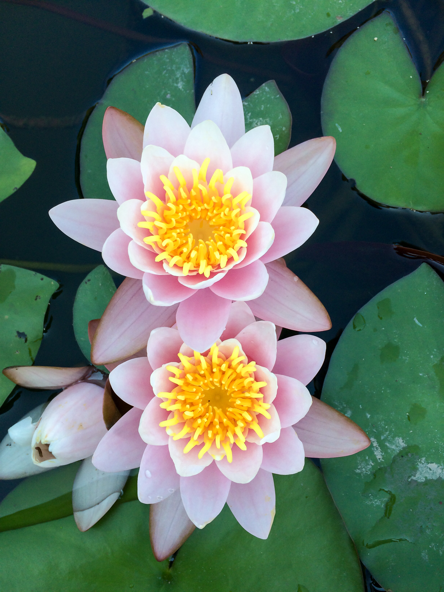
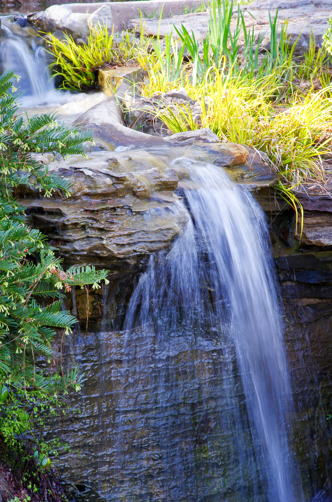
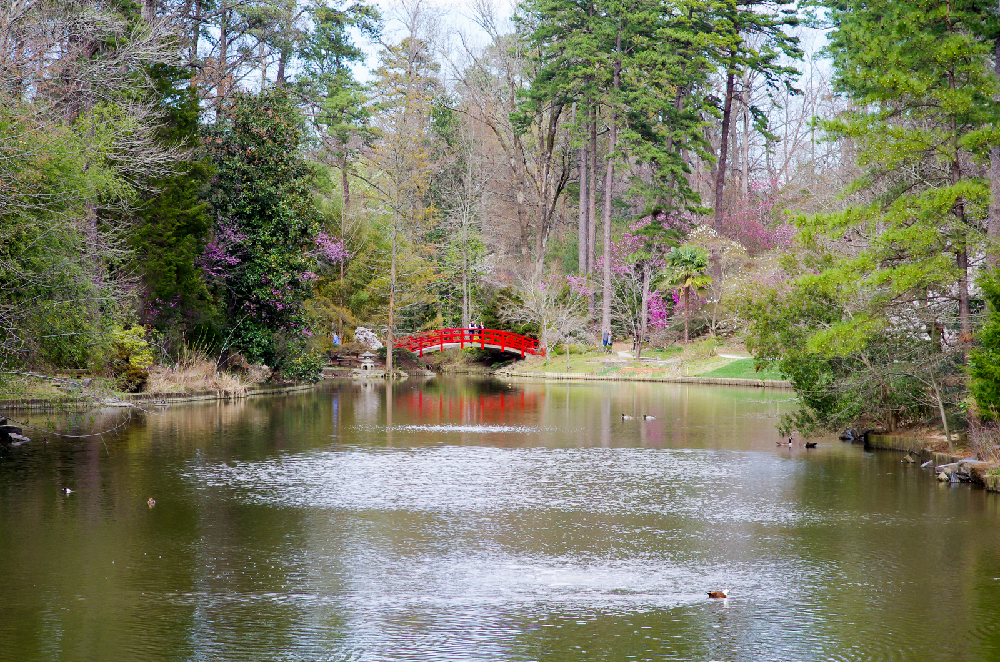

# Duke Gardens

_2017_

The 15-minute walk through the Garden to my work is the perfect way to start a day.

Spring is the most beautiful season of the garden.

I like to pass by this little waterfall in the morning. 

Walking around the pond in the afternoon is another way to relax.
