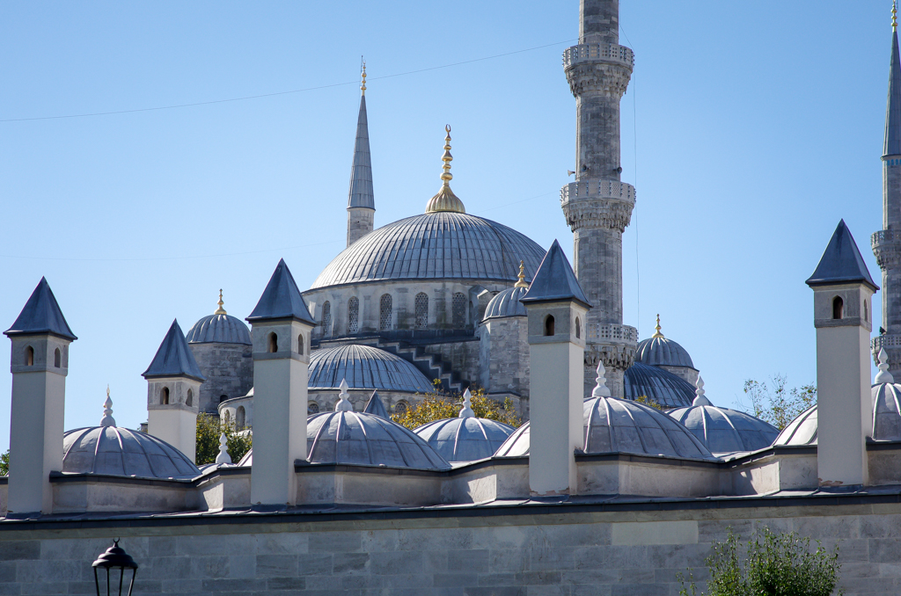
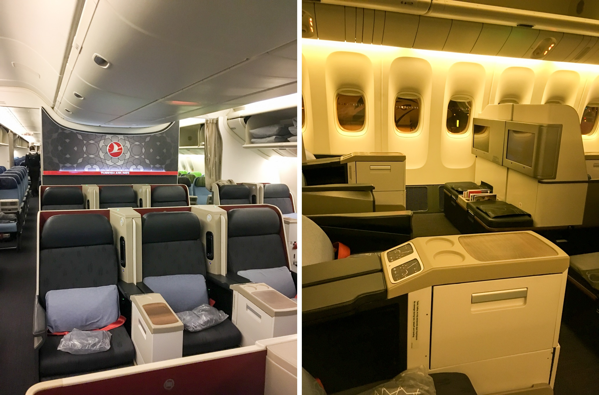
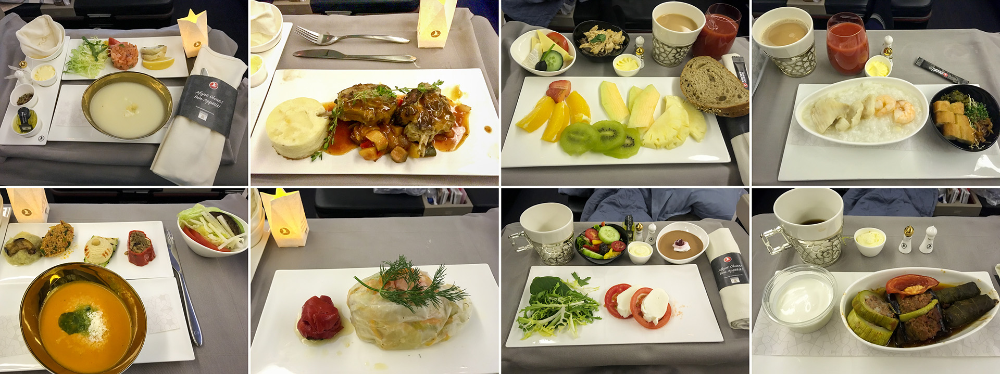
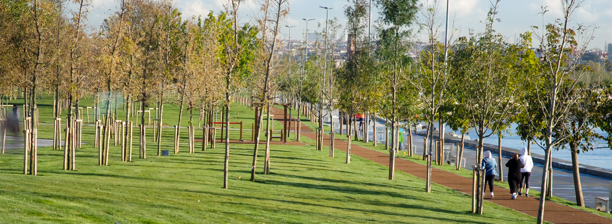
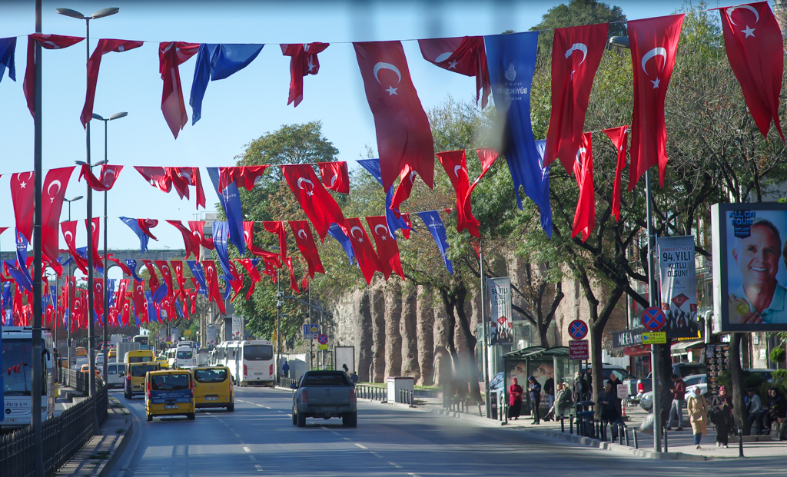
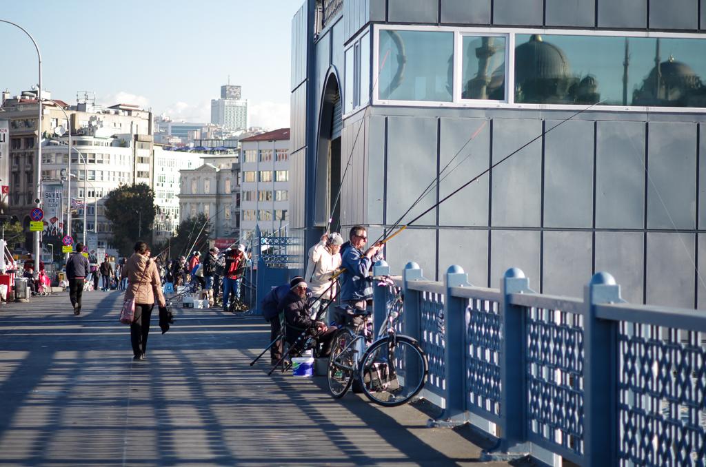
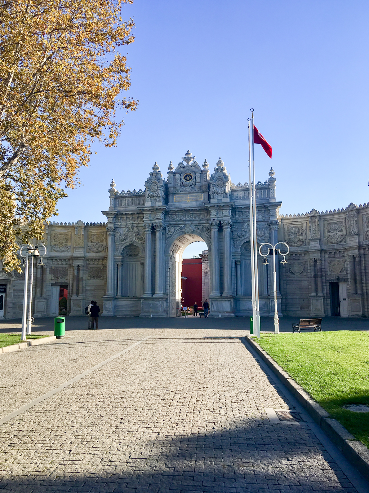
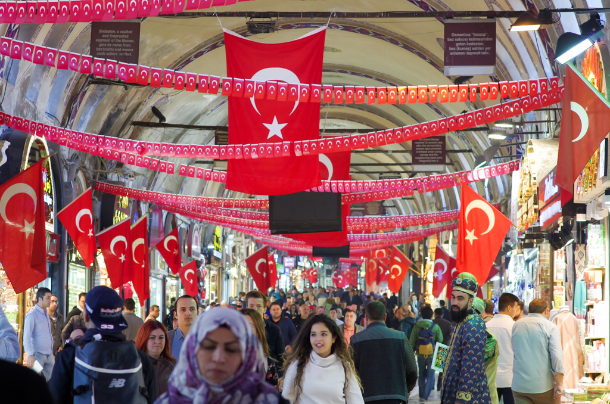
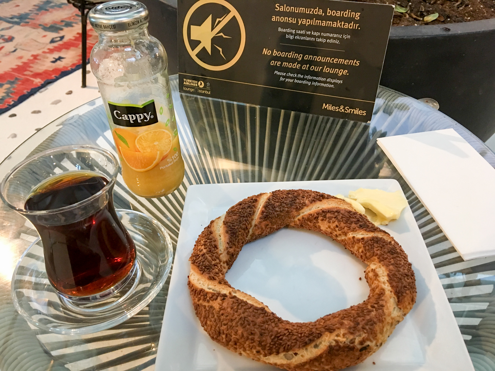

# The Turkish Experience

_November, 2017_

I like to try different experiences when travelling. Some people like non-stop flights. For me, I considered flights with long daytime stopover as a bonus. Travelling is not just about the destination. I also like Exploring along the way...

So, I have this trip with Turkish Airline, from China to the United States:

* CAN, 11:25PM - IST, 06:05AM
* IST, 03:00PM - ORD, 06:55PM

I have a 9 hour stopover at Istanbul, arriving in the morning and leaving in the afternoon, and Turkish Airline offers free tours to the city.

Blue Mosque - Istanbul, Turkey

The Turkish Airline business class has a 2-3-2 layout. Clearly the middle seat in the middle is the least favorite one. I picked the aisle in the middle, and it turns out that no body is seating next to me for both lags. Also there is free WIFI for business class passengers.

Turkish Airline Business Class - Boeing 777

The Turkish experience begins with the meal. It was almost mid-night when we took off. A chef walked around the cabin and took our orders. I am not sure if the chef has a lot to do on the phane heating the food and putting it on the plate. The food looks nice and tastes good.

Inflight Food - First Row: CAN-IST, Second Row: IST-ORD

It's a bit early when we got to Istanbul and the airport is kind of empty. The free tour won't start until 8AM. I had a about an hour and a half to spend. The Turkish airline arrival lounge is right opposite to the tour check in desk - The perfect place for getting a breakfast before the tour. I also took a shower there.

Unfortunately, my next flight is at 3PM, which prevents me to join any tours in the afternoon. I decided to do a morning bus tour and then stay in the city a bit longer by myself after the tour. The bus left the airport around 8:30AM and followed the coastal road to the city. 

Greenway along the Coastal Road

The bus will pass by a few sightseeing places but will only make two stops for us due to the limited time we have. The first stop is Galata Bridge (for about 10 minutes), and the second one is Dolmabahce Palace (for about 30 minutes, depending on the traffic). We had nice weather and traffic, so we got a little bit more free time at the stops.

Turkish Flags on the Street

Fishing on the Galata Bridge

Dolmabahce Palace

After visiting the Dolmabahce Palace, the bus goes back to the airport. Our driver was kind enough to drop me at a street near the Grand Bazaar. A lady from England and I got off the bus and walk to visit Grand Bazaar together. We both like taking photos. However, she is a a portrait person while I prefer landscapes. Grand Bazaar is market with pricy products, like gold and jewelries. We are not interested in any of them but there are lots of people. We both like to look at what people are doing. I bet she got plenty of good shots. We say goodbye to each other after the walking through the Grand Bazaar. She wanted to walk around the Bazaar but I would like to visit the Blue Mosque.

Grand Bazaar

After visiting the Blue Mosque and spending some time around the big square. I managed to use my gestures to get a turkish guy to help me getting a ticket and took the train back to the airport. There are multiple security checks at the airport. After getting through the check point, I grabbed a simit (Turkish bagel), a cup of Turkish tea and bottle of juice...

Simit, The Turkish Bagel
