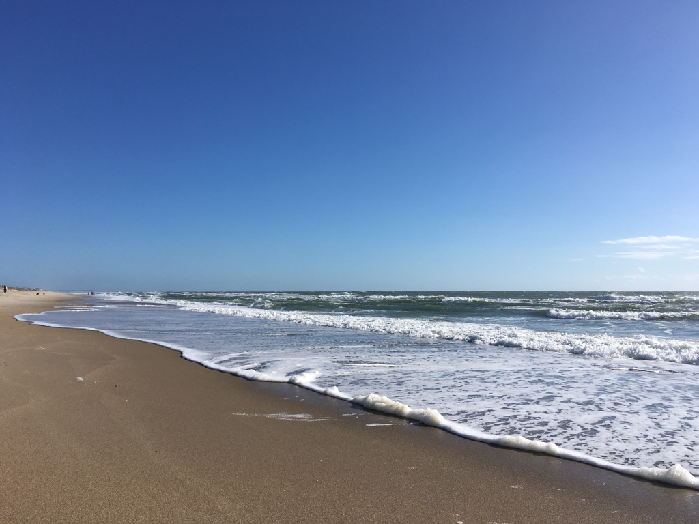

# North Carolina

_2016-_

Started my first job after PhD at Duke, I walk through the Duke Gardens almost every day. I got a parking permit for the lot next to the Garden. The parking fee is pretty cheap for this lot, and the 15-minute walk through the Garden to my working place is a pleasure.

Mountain and Sea seems to the two main topics for vacations. I like nature and road trips. I went to the [Blue Ridge Parkway](/page/swan/20161000_BlueRidgePkwy/) 3 years in a row. The Smoky Mountains is a great place to explore.

I also went to a few beaches on the east coast. Beaches in Carolina are not as beautiful as those in Miami. However, cruising along the [Outer Banks](/page/swan/20170704_OuterBanks/) and taking the ferries is another unique experience. Over 100 years ago, the Wright Brothers made the first flight in Outer Banks.
