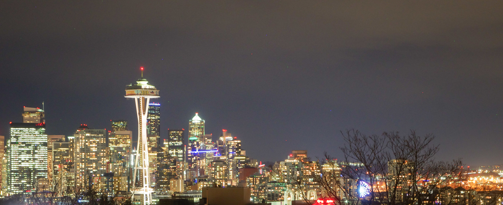
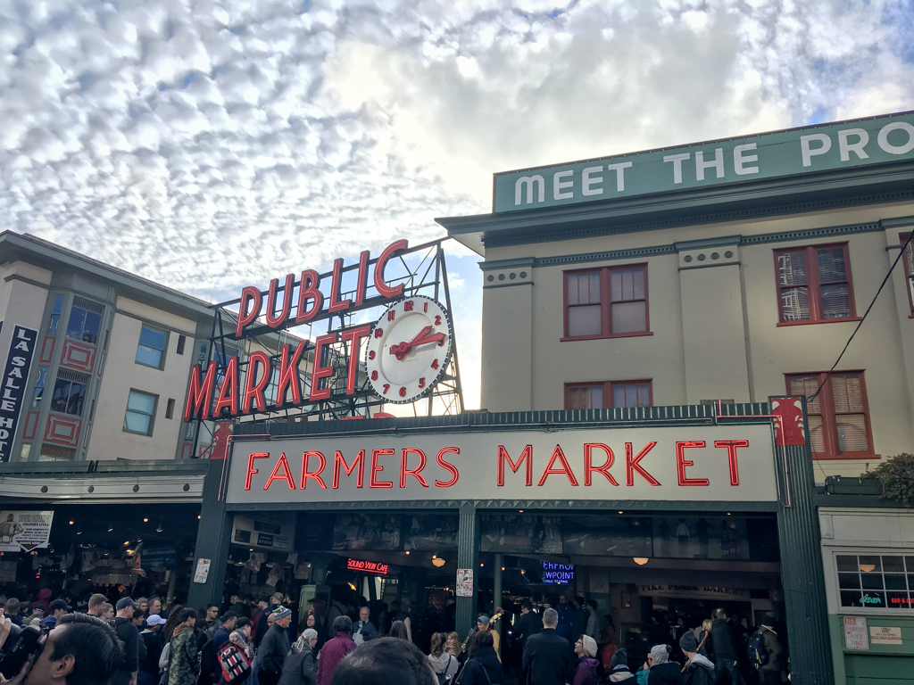
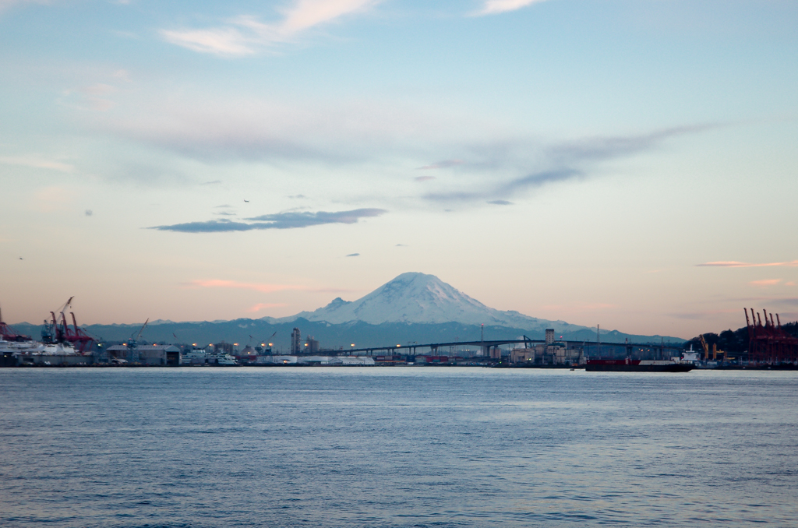
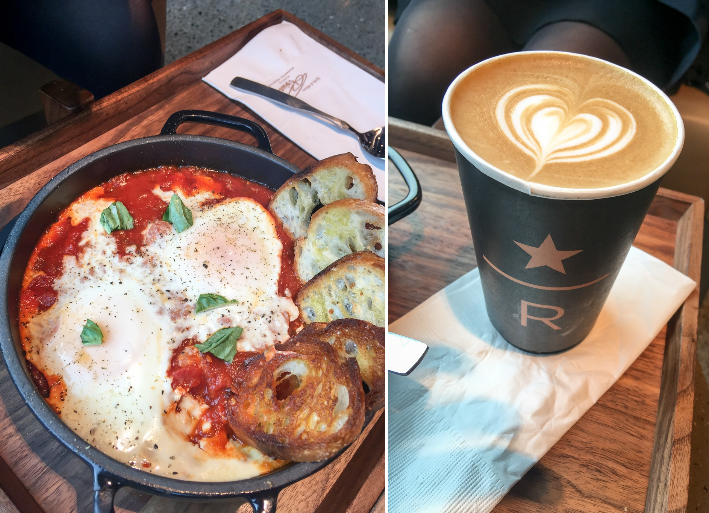
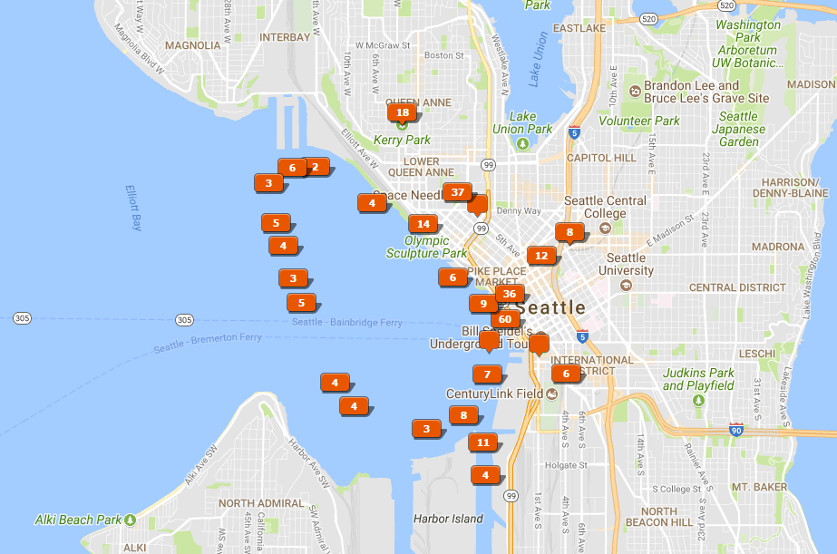

# Seattle

_January 2018_

A warm, relax winter weekend in a seaport city - Pike Place, Sunset Cruise, Space Needle, Boeing and Starbucks...

Seattle Skyline - I like looking at cities from a distance.

We decided to start our 2018 with our annual free nights at [Grand Hyatt Seattle](https://seattle.grand.hyatt.com). The hotel is located at the heart of downtown near a Link light rail station. The light rail gets us from the airport to the hotel in about 40 minutes. 

The famous Pike Place is only 10 minutes walk away. We actually went there everyday during our 3-day stay. It is an interesting place to explore, pretty crowded during the day. However, during the evening, walking through the half empty market is another experience. You can also get a evening coffee easier at the original Starbucks store, which is still using the original logo.

Pike Place Market - I know it because of Starbucks.

Luckily, we had pretty nice weather for all of our three days in Seattle. On the second day, we 
1. Took the monorail to the Seattle Center
2. Went up to the observation deck of Space Needle
3. Walked around the Olympic Sculpture Park
4. Had lunch in Chinatown
5. Spent the evening on a sunset cruise

Mount Rainier - From a sunset cruise.

Starbucks has a Reserve Roastery in Seattle. It's really big but also getting crowded easily in the morning. I wasn't a fan of Starbucks, but I also think they make good coffee. In the roastery, there is a bakery section by Italian Princi. I forgot the name of the food I ordered (I am really bad at remember names). 

Breakfast - At the Starbucks Reserve Roastery.

Photo Locations - Our footprints in Seattle.