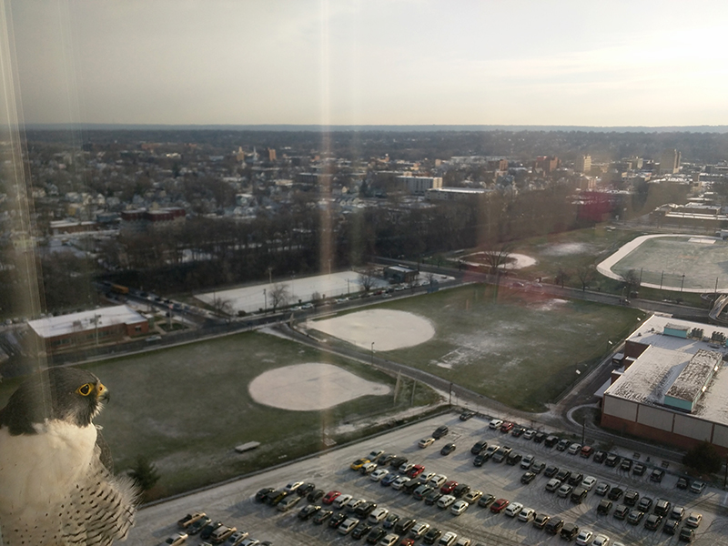

# Playing with Top Coder

_January 20th, 2016_

After someone from Mountain View visited this website, I realized that it is not a good idea to let smart people hit a few pages that are under construction. 

I have been playing with [TopCoder](https://www.topcoder.com) arena these a few days. It was roughly 10 years ago when I first came across TopCoder. Google code jam was powered by TopCoder at that time. The rules are interesting, you are not only asked to solve the programming challenge but also given a chance to find bugs in other submissions before your code go through the system test. I didn't really try to solve problems in the TopCoder arena until recently. 

Google suggested we use TopCoder to practice for their interviews. So I played with it for a few days. The problems are interesting, though some of them are a bit lengthy. After the initial phone interview, I feel that:
1. Doing division-2 level-1 problems would be enough for the phone interview. 
2. Solving a problem in the Arena does not mean that the solution is good. Since the points in TopCoder are calculated based on the time you used to solve the problem, the most straight forward way to get a solution is by brute force. A lot of people actually did that. Although we have a 2-second time limit, but that's pretty much enough for many brute force solutions. Usually in the interviews, people are looking for efficiency, and interviewers want nice and clean code.
3. Passing the interviewer test is much easier than passing the system test. Interviewers are not computers, they may not notice the small errors. So, I think the key point for the interview is to convey the idea, discuss and improve the solution. Yes, we need to have a solution first.

Visiting Google is exciting...and this is going to be my first visit to the Silicon Valley.
