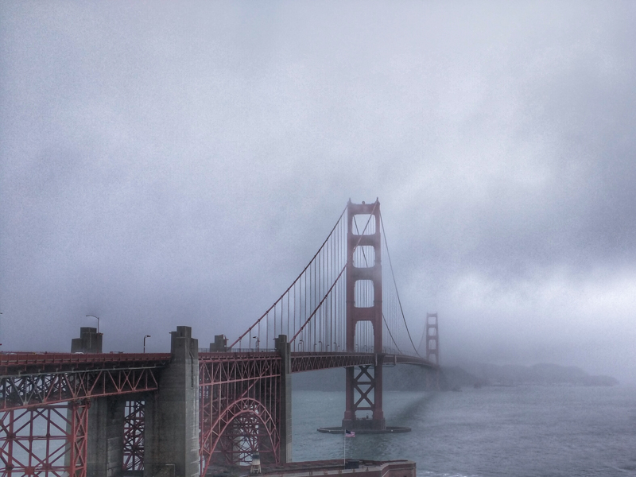

# Live in My Life

_Feburary 5, 2016_

Met an old friend after more than ten years...We didn't have a lot to talk, but I was impressed by some small things. We will make a difference if we work hard. We are not living in other people's life. There are so many strange things happened last year around the world (look at the gas station), around China (look at the stock market)...Some of them are just like planned, sophisticated...I see so many people in the younger generation (just a few years younger) are living a life like being driven...They are not working hard as their parents did, but keep trying to show a much better life to the others. Everything comes with a cost. I have no idea how they make up the cost...who is losing? Am I looking at the wrong person?

I know my parents worked hard to bring me my life. I will work to live in my life, and hopefully bring them better remaining years.

A new year's wish, to my parents, on the other side of the world.