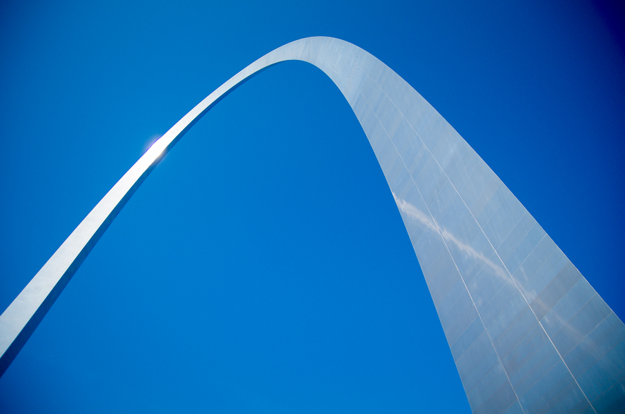

# Gateway to the West

_May 4th, 2016_

Life is running like a machine.

It is always hard to find time to travel for a long time. Finally, I got a chance to plan a trip to the west, but turned around as soon as I crossed the Mississippi river. A special trip, somewhat unexpected...maybe...the gateway means another door for me.

Sometime I will think of something pretty naive. If we made a same decision 15 years ago, can we image different lives today? We experienced a lot to get here. Not sure about the future. But at least I enjoyed the time, the distance and the memory.