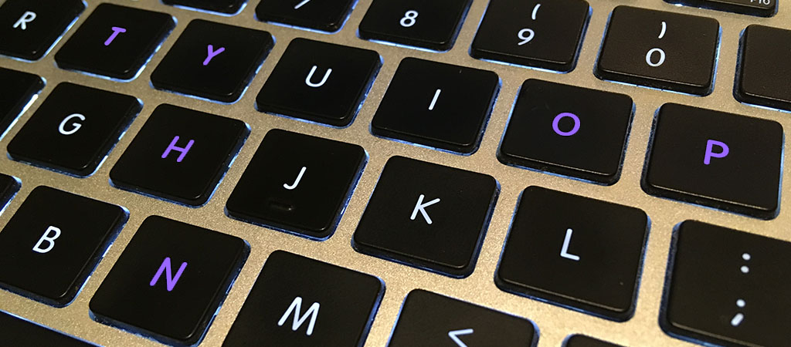

# Python IDE?

_August 6th, 2016_

Lack of a good IDE means less productive.

Python is popular in the lab I am working for. I have been playing with Python and Django almost every day in the last two months. I think more and more colleges are using Python as the language to get students into the world of coding as it is powerful, flexible and easy to learn. With python, we can focus on the functional part of the code without worrying too much about low level implementation. In this sense, Python is good for students and people doing research, they can use Python to quickly develop something that is actually working, say a prototype.

However, I am still not sure how people maintain the Python code in big project. So far I can see, the maintenance of Python code becomes increasingly harder for big code repositories. Because of the flexibility, refactoring is a big trouble in Python. If we use string literals to access object attributes/properties, it would be hard to rename the attribute or property without looking into each occurrence of the string literal. At least I couldn't find an IDE that can do such renaming automatically.

A good IDE is really helpful when we are working on a big project. For example, we are not supposed to remember everything we in the program or the API provided by other people. A good IDE will fetch the information of well documented functions and suggest them to us as we type in the code (Yes, we need good documentation as well). In python, this is somewhat tricky, as we don't need to declare the type of the variables (I still think this will cause a big trouble in big projects). Basically we need a tool to prevent errors and incorrect usage of the functions. The flexibility of the Python language makes it hard to develop a good tool for maintenance. And human will always make mistakes.

I didn't use any IDE when I learned python. I use only text editors, because I only write scripts, usually no more than 100 lines. Now I am maintaining a few thousand lines of code. Each time when I want to do a refactor, I have to think carefully and search for the string manually to make sure that everything is OK. I used the community version of PyCharm for editing the python file. The color of the PyCharm editor looks a bit ugly (yes, we can customize the color, but I don't want to go over the definition of dozens of items one by one). The community version does not support Django and CSS, so I get no suggestion when working with Django and CSS. I also used the lightweight Visual Studio Code, it actually supports Python pretty well (but not as good as PyCharm) and it looks much better than the PyCharm editor. Now I am trying eclipse with PyDev and the Visual Studio with Python Tools. Looks like they are better choices, but they require more configurations.

