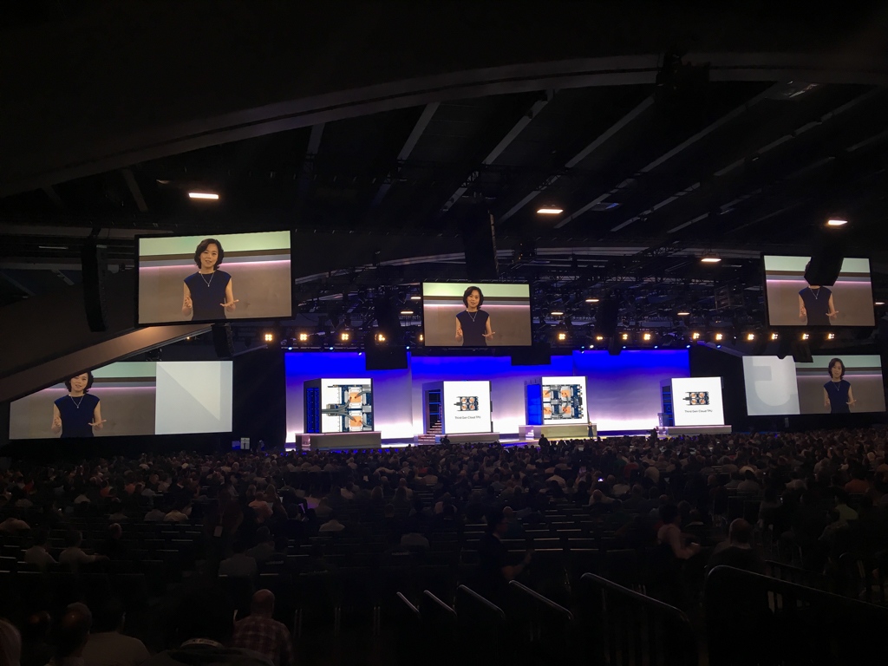

# Decoupling on the Cloud

_July 29, 2018_

Google Next is not an academic conference. It's more about learning the trend of future products, or how people approach real world problems.

I think the real world problems usually involve lots of human biases. Different people have different preferences, so do the definition of problems. If we always use our own mind to approach a problem, maybe our solution can only solve the problem in our mind, but not the problems of other users, or customers. Google is introducing many managed cloud services this time, so that we can build our application with the microservices. To build our application, we build our own microservices on the existing products. Instead of have a big integrated application, a solution with inter-connected microservices is probably easier to maintain.

Come to think of it, this is kind of have a decoupling control system. A complicated problem is like a multiple-input-multiple-output system, maybe we should approach it by first building interfaces to decouple it into single-input-single-output (SISO) system. Then each SISO system can solved (controlled) by a microservice.

Sometimes I am surprised how the control system is built into my mind.
