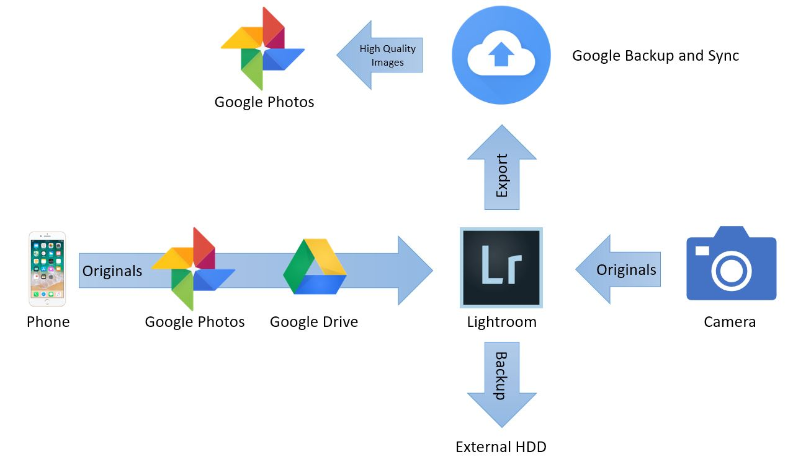

# My Journey with Photos

_August 21, 2018_

## Growing up with Photos
When I was a small kid, we had photos using a traditional film camera from time to time. A camera was something expensive at that time. I never own one. Taking each photo cost some money (because we have to buy films) and we cannot see the it until we take the films to a shop and wait for a day or two. To see it on a computer, we have to scan it, often resulting in a low quality image.

My first camera was a Canon PowerShot A510. It's 2005, more than 10 years ago. I got my first DSLR in 2010 and now I usually take photos with my iPhone. At this time, I have more than 30,000 photos. How to efficiently manage the photos is actually a challenging problem. And I think this is a problem for everyone. Sometimes I have friends or relatives travelled together and taking pictures for me. However, it usually takes a long time for them to dig out the photos and send them to me…

## Managing Photos, My Low Cost Solution
Managing photos is really a personal thing.

Around 2010, I started to use Aperture to manage my pictures. Unfortunately, in 2014, Apple announced that Aperture will be discontinued. During 2015. About the same time, I moved from MacBook to a Windows desktop, mainly because I can use two 24 inch monitor at home. After that, Adobe Lightroom (Now it is called Lightroom Classic) replaced Apple Aperture as the picture manager in my computer. Lightroom and Photoshop are a great pair of software for professional photo management and editing on a single computer. They are really powerful tools for a photo studio. However, I want to: 
* See and modify my pictures anytime, anywhere.
* Search my pictures with minimum efforts to organize and tag them.

My current photos workflow utilize the unlimited uploads offered by Google photos and can be used for both Windows and Mac. Adobe Lightroom is currently the central software of my workflow. I am using the Lightroom Classic (Adobe also offer a cloud-based version of Lightroom CC). With the Lightroom Classic, data are divided into two parts on my computer: the photo originals and the Lightroom catalog, which include all modifications to the photos.

My solution includes 4 parts:
1. Edit. Lightroom and Photoshop are still the best pair.
2. Organize and Search. Lightroom provides flexible ways for manually organizing photos. I use Lightroom to organize my originals, put some photos into an album so that I can work on them together, make photobook from time to time…After all the edits are done, the photos are exported and uploaded to Google Photos, which knows how to do the search.
3. Synchronize. All originals are managed by Lightroom. All processed photos are exported and uploaded to Google Photos so that it will be available on the Cloud.
4. Backup. This last and the most important part can be done with Windows "File History" or Apple "Time Machine".

## Something more about Backup
Backup is not the same as synchronize. Even if we have data reliably synchronized to the cloud, we have to have a backup system. Synchronizing data is just making a copy, while backups include all the history of our data. So if something goes wrong, we can restore the data to any previous backup checkpoint. I have been backing up my contacts, phone number and photos for nearly 10 years. For photos, the backups includes the lightroom catalogs and photo originals. I am surprised that there are still young people saying that they lost all contacts number when they lost their iPhone. 

According to my experience, the most problematic part is moving from one backup system to another. Usually the two systems are not compatible and we may need to re-organize and backup everything again. The new backup system will not have the history of the old system. I tend to make mistakes during this kind of migration.

Windows system comes with a "Backup" feature, it is also called "File History". This is basically the Windows version of Apple "Time Machine". I use this to back up the data to an external hard drive daily. The process is done automatically when the computer is turned on. The problem with Windows backup is that it may not notify you if the backup was failed or skipped for some reason. Sometimes I found that the last backup was two months old and I have no idea what was wrong.

On the other hand, Apple "Time Machine" is doing a much better job. It will notify me if my data haven't been backed up for a long time. I don't seem to remember any problems with that.

## My Problems
The problems with my workflow come from the fact that the photos flow only from Lightroom to Google.
1. There is no way to keep the photo organization in Lightroom when view photos in Google Photos.
2. Google is great at search, but I cannot do the same thing in Lightroom.
3. If I edit a photo in Google Photos after I imported it to lightroom, it won't go back to Lightroom.
4. At this time, Google is not easily accessible in China.
5. There is no way to import live photos.

I haven't really tried Adobe's cloud-based Lightroom CC. It integrates with the Lightroom mobile app, so I think it can be used to replace the Google Photos in my workflow (Problems 1-4 solved?). Currently the 1TB photographer plan cost $20 a month. I think this is somewhat expensive without solving the live photo problem.

## Apple's Solution
Back in 2014, I cannot understand why Apple would drop Aperture and focus on the new Photos app. The Apple Photos app was just like a downgraded version of Aperture. Now things seems to be more clear. Apple would like to provide a better solution for a bigger group of people, not just the professionals. And the cloud-based solution is probably more profitable.

As I am getting more photos, I want to spend less time to organize and fine-tune the them. I like to have software automating my workflow. With the improvements in the last a few years, Apple Photos is getting closer to replacing my current solution. It integrates the editing, organizing and synchronization of photos.

It is unclear how Time Machine works with the iCloud photo library. Apple mentioned that if we restore a library, all deleted photos are restored. However, how about the new photos we added after the backup? Does restoring the library remove the recent added photos? How about the adjustments? Seems the only way to go back in time is to restore the whole library. If we use iCloud, all originals have to be stored in the Library, too. So the library will be really big in size. If I want to restore only one picture from the backup, I may have to restore a library of 100GB? I prefer the way how Lightroom separate catalog (library) and originals.

The Pros:
1. Works in China
2. Supports live photos
3. All adjustments are synchronized

What's holding me back?
1. Works on apple products only…plus a simple iCloud website
2. True Multi-screen support on Mac?
3. Time Machine backup / restore is unclear.
4. I will lost my adjustment history in lightroom
5. I will lost some editing features, like applying presets while importing photos
