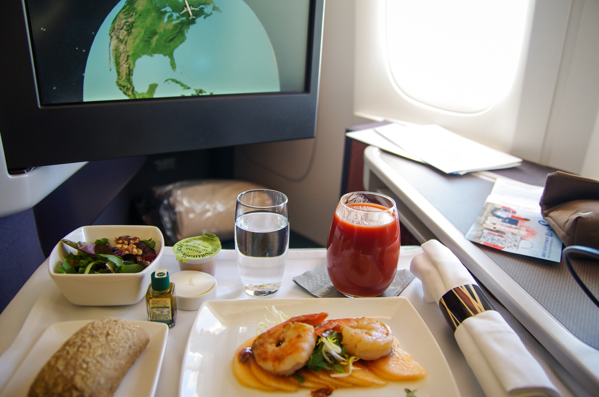

# Which Credit Card I Should Use to Get Max Rewards?

_November 10th, 2018_

A few years ago, I was pretty good at remembering which credit card to use in order to maximize the rewards. As I am getting more and more credit cards, things become complicated. So I decided to make a table for them. Actually I asked the computer to make this table. There are many credit card blogs or websites making recommendations for the hot deals.

## My Credit Card Rewards Table
Following the most recent table based on my valuation of the points and miles.

Loading data...

## Miles and Points
For cashback rewards, we can simply compare the cash value. However, miles and points all have different values. Some of them seem to value more than cash, but only if collect and use them for your needs. 

There are many websites talking about how to earn and travel with miles and points, like [Million Mile Secrets](https://millionmilesecrets.com/), [The Points Guy](https://thepointsguy.com/
), [One Mile at a Time](https://onemileatatime.com/), etc. It is true that you will get a high value on each mile/point when you redeem miles and points for premium travel (long-haul business/first class tickets and high-end hotels). My first business class travel was on Cathay Pacific from JFK to HKG. The 16 hours on the flight becomes short and enjoyable.

However, you may not get a lot of chances to redeem those miles/points if you don't travel a lot, or if you don't have a lot of points. Until you actaully use the points and miles, they are just some number sitting in your account. My valuation for the points and miles are less than those found on other websites due to the fact that:
* Availability is limited on high value redeemtion.
* Redeeming for high value travel does not always fit my needs.
* Small number of points/miles is useless

Award travel is not always available. For many people, time is more valuable. Especially for business class travel to China, I found the availability to be very limited. The face value of an air ticket or hotel room rate does not mean a lot when it does not fit my needs.

Besides the sign-up bonus, it is not easy to get enough points for a business class ticket or a fancy hotel night. Usually it requires spending $50,000 to $100,000, depending where you want to go. Until you get to that number, each point/mile values much less. What's worse, airlines and hotels tend to de-value the miles and points every a few years. So, it doesn't really value a lot if you have to spend a few years to collect the points for one travel.

Unlike cash, points and miles are useless when you don't have enough points to redeem for something. For example, you can't really do anything with less than 5000 miles. But you can get $50 if it is a cash reward.

## Chase Sapphire
One thing I observed is that people writing blogs on those websites like the Chase Sapphire credit card very much. I think it gets you pretty good rewards if you travel a lot. For me, I don't find it easy to justify the $95 annual fee. As a baseline, the Citi Double Cash credit card offers 2% cash back. The Sapphire card get you 2 Chase point for dining and travel and 1 Chase point for other purchases. A Chase reward point can be transfered to hotel points or airline miles. 

However, based on my table above, it is really hard to get 2 cents out of a point. So using the Sapphire card for everyday purchases does not really make sense to me. To makeup the annual fee, we have to get the addtional points from dining and travel, or transfer points earned from the Chase Freedom credit card (which earns you 5 points per dollor on rotating categories). To get the $95 fee out of the additional points from dining and travel, I will have to spend $10,000 on dining and travel each year if I value the points at 1 cent each. Or $5,000 if I value it at 2 cents each. I am not traveling a lot at this moment so I don't like the feeling of having a bar to reach every year.