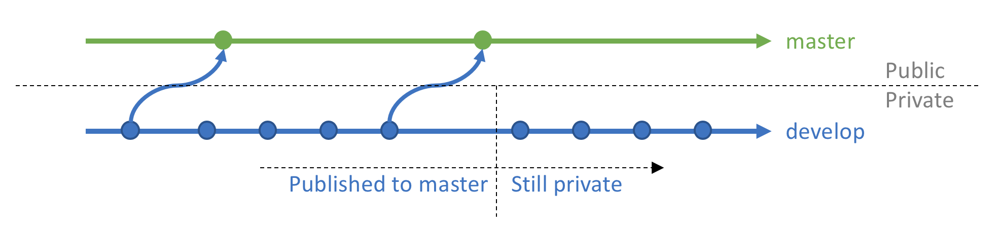
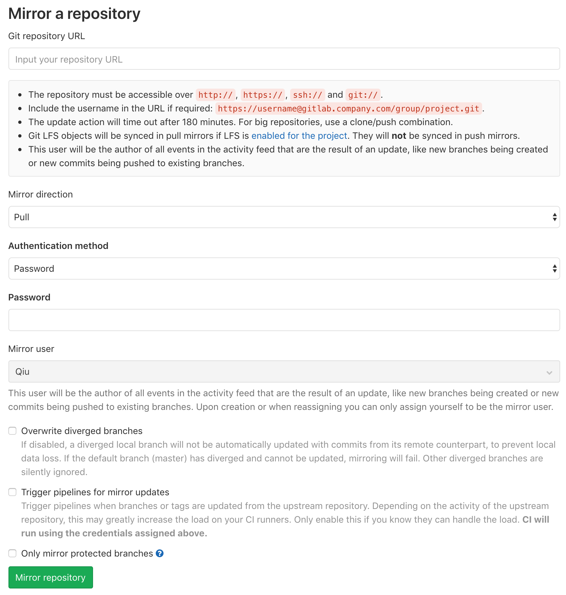

# Title

_May 4, 2016_

Now both GitHub and GitLab offer private or public repositories to free accounts, but what if we would like to keep a repository partially private? I don't think there is such a feature explicitly.

With a simple Google search, I see people have different ways to do this, such as:
* Keep a sub-module private.
* Keep two separate repositories and do merges between them.

I don't like the idea of keeping a sub-module private. Because the whole repository is unlikely to be functional without a sub-module. What I would like to do is:
* Have a fully functional public repository
* Keep the recent developments private

The reasons for doing this:
* We may not want to release unstable code in a development branch.
* We may want to keep the latest technology private (copy right) for a while.

Keeping two separate repositories seems to be the way to go. Then, my question is, how do I minimize the maintenance efforts? My solution is to use the "Mirroring repositories" feature in GitLab.

"Mirroring repositories" allows us to mirror protected branches only. So I setup the mirroring from my private GitLab repository to my public GitHub repository with only the protected branches. Those protected branches will public, the other branches will be private. For instance, I only make the master branch public. When I would like to release more code, I simply merge some commits to the master branch.