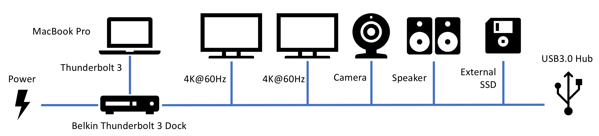

# Meet the Thunderbolt 3 and USB-C

_July 20, 2019_

Thunderbolt 3 enables us to connect dual 4K monitors at 60Hz, power supply and a bunch of other devices with one cable. It uses USB-C as the physical port, but with a much higher capacity. Without thunderbolt 3, USB-C when can only support a single 4K monitor at 60Hz, with no addition data at the same time.

## Using Thunderbolt with Dual 4K
Before I moved to Macbook Pro, I had a tiny desktop and a surface.  I use Google Drive and OneDrive to sync files. The problem is, if I don't use one of the computers for a while. It is going to take a while for it to sync the files. And I also have to update the system, pull the git repositories and configure the dependencies. All these takes time, and sometimes I was frustrated when the internet connection in my hotel room is bad.

My solution is to replace the desktop and laptop with a laptop and docking station. However, I would like to upgrade my monitors to dual 4K@60Hz. So Thunderbolt 3 becomes the only single cable solution available at this time.

I uses the Belkin Thunderbolt 3 Express Dock HD to connect to my new MacBook Pro with a single Thunderbolt 3 cable. This single cable provides capacity for 85W charging power, dual 4K@60Hz, external SSD for Time Machine backup, wired Ethernet and other USB devices. I also connected a USB3.0 hub to the dock to provide more USB ports.

## The Allocation of Bandwidth
Thunderbolt 3 has a capacity of 40Gbps, each 4K@60Hz display will use about 16Gbps, i.e. 32Gbps for dual monitors. The remaining 8Gbps are shared by other device. Most of them will probably used by external hard drive when transferring data. When I use my Samsung T3 SSD via the USB3.0, I got a read speed around 300MB/s (i.e. 2.4Gbps). 

See also [Thunderbolt 3 Technology Brief](https://thunderbolttechnology.net/sites/default/files/Thunderbolt3_TechBrief_FINAL.pdf)

## USB-C without Thunderbolt Only Supports Single 4K@60Hz
Many laptops now have USB-C ports, but not all of them support thunderbolt. Without Thunderbolt, the USB3.1 standard can only provide only 10Gbps capacity. However, a single 4K@60Hz requires around 16Gbps. So USB3.1 does not seem to be able support 4K@60Hz. We can still use 4K@30Hz though. To support 4K@60Hz through USB-C, it has to be in DisplayPort Mode and cannot carry any additional data. 

See also [Explaining 4K 60Hz Video Through USB-C Hub](https://www.bigmessowires.com/2019/05/19/explaining-4k-60hz-video-through-usb-c-hub/) and [The Difference between USB-C and Thunderbolt 3](https://thunderbolttechnology.net/blog/difference-between-usb-c-and-thunderbolt-3)

## Thunderbolt 3 Requires Cable and Adapter
If you connect something to Thunderbolt 3, the cable and the adapter needs to support it as well. Unfortunately, the cable comes with the new MacBook Pro is NOT a thunderbolt cable. Adapters are mainly for 4K monitors. Many USB-C adapters/hubs on Amazon or eBay can only support 4K@30Hz.
